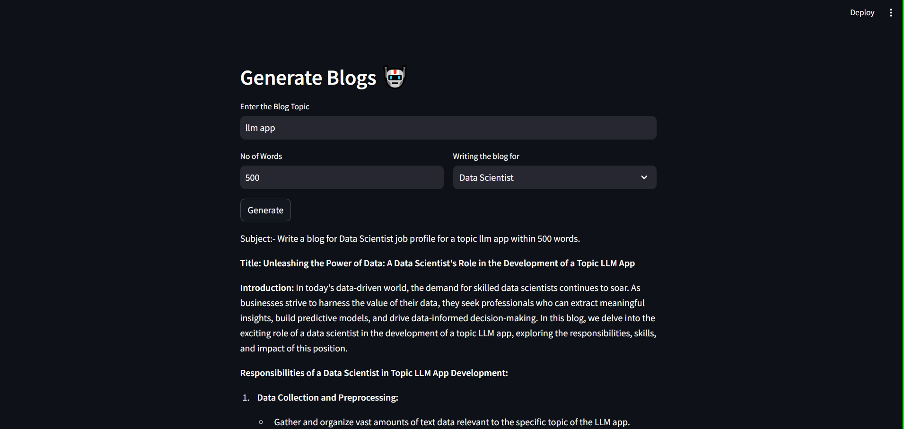

# Blog Generator

This repository contains code for a blog generator that uses two different language models, LLama 2 and Gemini Pro, to generate blogs based on user input.


## LLama 2

The LLama 2 model is utilized for generating blog content. It involves the following steps:

1. **Input**: Provide a blog topic, number of words, and select the target audience.
2. **Prompt Template**: A template is used to structure the prompt for the LLama 2 model.
3. **Model Generation**: The LLama 2 model generates a blog based on the provided input and template.

### How to Use LLama 2

1. Install the required dependencies:

```bash
pip install -r requirements.txt
```

2. Set up the environment variable for Hugging Face API key:

```bash
export HUGGING_FACE_KEY="your_hugging_face_api_key"
```

3. Run the application:

```bash
streamlit run app_with_llama_2.py
```

## Gemini Pro

The Gemini Pro model is utilized for an alternative approach to generate blog content. It involves the following steps:

1. **Input**: Provide a blog topic, number of words, and select the target audience.
2. **Prompt Template**: A template is used to structure the prompt for the Gemini Pro model.
3. **Model Generation**: The Gemini Pro model generates a blog based on the provided input and template.

### How to Use Gemini Pro

1. Install the required dependencies:

```bash
pip install -r requirements.txt
```

2. Set up the environment variable for Google API key:

```bash
export GOOGLE_API_KEY="your_google_api_key"
```

3. Run the application:

```bash
streamlit run app_with_gemini.py
```

## Getting Started

1. Clone this repository:

```bash
git clone https://github.com/shaikh-vasim/llm_blog_generator
cd llm_blog_generator
```

2. Set up the required environment variables as mentioned above.

3. Run the desired generator script based on the model you want to use.

4. Open the provided web interface and input the required details to generate a blog.

## Contributing

Feel free to contribute to this project by submitting bug reports, feature requests, or pull requests. Your contributions are welcome!

## License

This project is licensed under the MIT License - see the  file for details.

Replace `app_with_llama_2.py` and `app_with_gemini.py` with your actual Hugging Face API key and Google API key, respectively. Adjust the script filenames (`app_with_llama_2.py` and `app_with_gemini.py`) if needed. Additionally, include any specific instructions or considerations for users in your README file.
